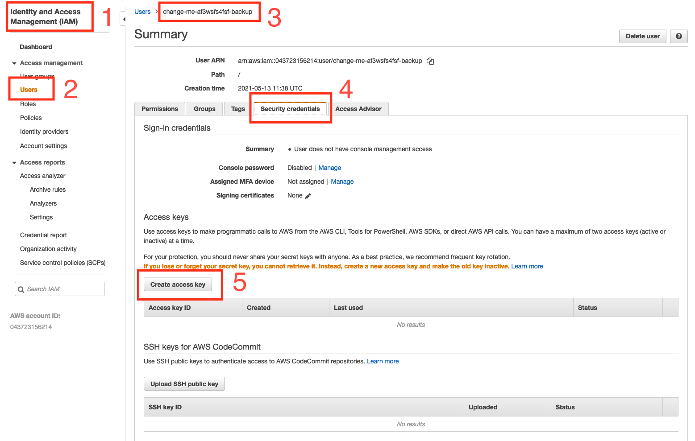

## Info
This Terraform code is a ready-to-deploy backend for [s3sync](https://github.com/what-name/docker-s3sync).

## Components
Resource | Name | Notes
--- | --- | ---
S3 Bucket | `<project-name>-cloud-backup` | A versioned bucket.. Lifecycle policies take the data straight to IA Storage Class, and delete noncurrent objects after 14 days. Encryption by default with a KMS key. All public access blocked.
IAM User | `<project-name>-backup` | Has a pair of access and secret keys [manually] that s3sync uses for backup. The attached inline policy gives fine tuned access to this bucket. It also has access to the KMS key.

## Deploy
- Make sure you have Terraform [installed](https://www.terraform.io/downloads.html) - `terraform --version`
- Make sure you have a pair of Access and Secret Keys in your terminal's env that can deploy resources to your target account - `aws sts get-caller-identity`

```
git clone https://github.com/what-name/s3sync-backend.git
cd s3sync-backend
# Modify the env.auto.tfvars to your environment
terraform init
terraform plan
terraform apply
```

Additonally, take a look at [this thread](https://forums.unraid.net/topic/106320-support-what-name-s3sync/?tab=comments#comment-992274) for more information.

## Usage
After the backend has been deployed, you need to create a pair of Access & Secret keys to use with `s3sync`. 
1. Go to the AWS console
2. Go to IAM
3. Click on Users in the left panel
4. Click on the user that was just created, named '...-backup'
5. Click the "Security Credentials" tab
6. Create a pair of Access Keys (make sure to save it, it's only displayed once)


